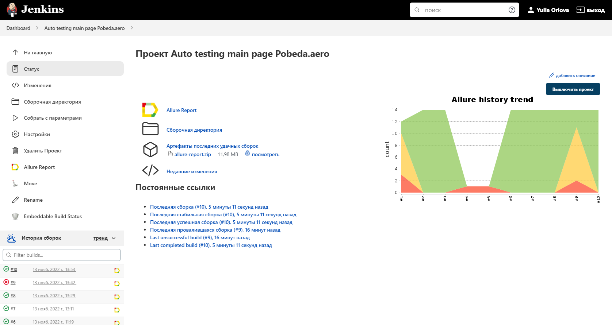
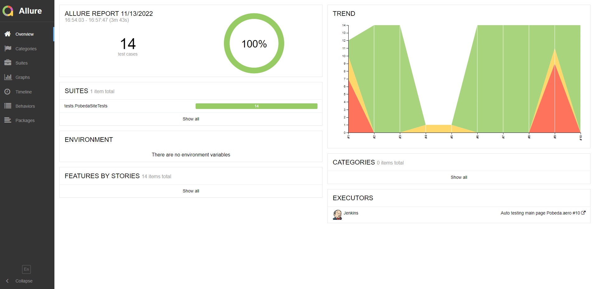
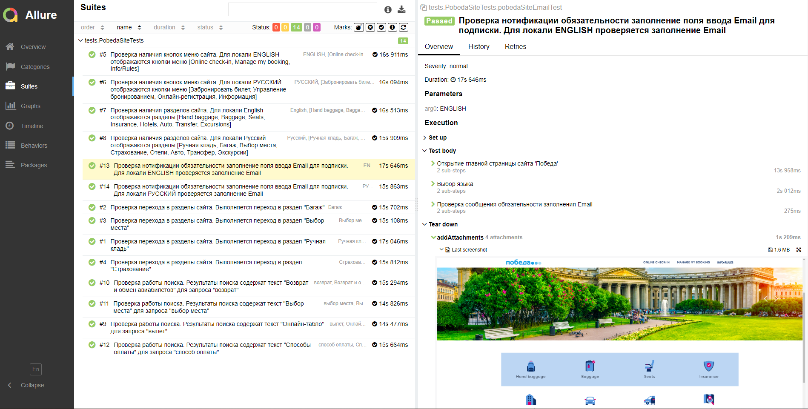
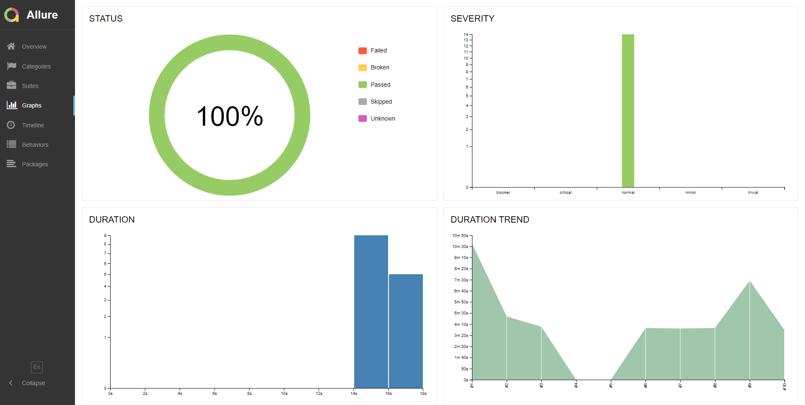
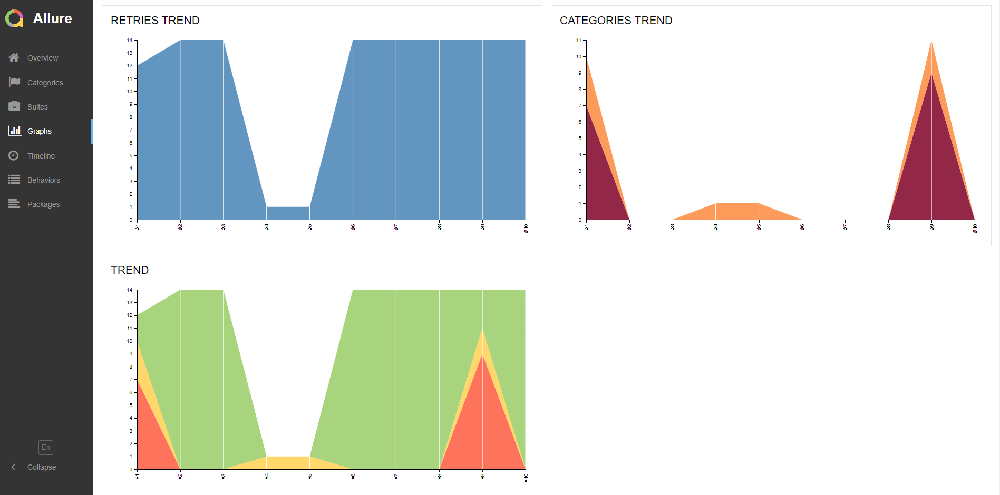
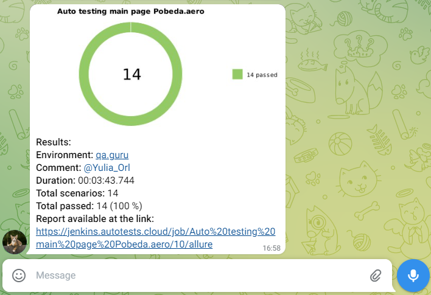

# Проект по автоматизации тестирования главной страницы сайта Pobeda.aero

## :green_book: Содержание:

- [Использованный стек технологий](#computer-использованный-стек-технологий)
- [Варианты запуска тестов](#running_woman-варианты-запуска-тестов)
- [Сборка в Jenkins](#-сборка-в-jenkins)
- [Allure-отчет](#-allure-отчет)
- [Интеграция с Allure TestOps](#-интеграция-с-allure-testops)
- [Уведомление в Telegram с использованием бота](#-уведомление-в-telegram-с-использованием-бота)
- [Видео запуска одного из тестов в Selenoid](#-видео-запуска-одного-из-тестов-в-selenoid)

## :computer: Использованный стек технологий

<p align="center">


</p>

Параметризованные автотесты написаны на <code>Java</code> с использованием <code>Gradle</code> и <code>JUnit 5</code>.
Для UI-тестов используется фреймворк [Selenide](https://selenide.org/).
Тесты можно запускать локально или удаленно с помощью [Selenoid](https://aerokube.com/selenoid/).
Сборка в <code>Jenkins</code> реализована с формированием Allure-отчета и отправкой уведомления с результатами тестирования в <code>Telegram</code> после завершения прохождения тестов.

Allure-отчет включает в себя:
* названия тестов с шагами выполнения;
* скриншот страницы в браузере в момент завершения автотеста;
* Page Source;
* логи браузерной консоли;
* видео выполнения UI-тестов.

## :running_woman: Варианты запуска тестов

### Локальный запуск тестов
С параметрами по умолчанию
```
gradle clean test -Denv=local
```

При необходимости можно изменить параметры запуска
```
gradle clean test
-Denv=local
-Dbrowser=${BROWSER_NAME}
-DbrowserVersion=${BROWSER_VERSION}
-DbrowserSize=${BROWSER_SIZE}
```

### Запуск тестов на удаленном браузере
```
gradle clean test -Denv=remote
```
При необходимости можно изменить параметры запуска

```
gradle clean test -Denv=remote
-Dbrowser=${BROWSER_NAME}
-DbrowserVersion=${BROWSER_VERSION}
-DbrowserSize=${BROWSER_SIZE}
```

### Параметры сборки

* <code>BROWSER_NAME</code> – браузер, в котором будут выполняться тесты. По-умолчанию - <code>chrome</code>.
* <code>BROWSER_VERSION</code> – версия браузера, в которой будут выполняться тесты. По-умолчанию - <code>100.0</code>.
* <code>BROWSER_SIZE</code> – размер окна браузера, в котором будут выполняться тесты. По-умолчанию - <code>1920x1080</code>.

##  Сборка в Jenkins
<a target="_blank" href="https://jenkins.autotests.cloud/job/Auto%20testing%20main%20page%20Pobeda.aero/">**Jenkins job**</a>
<p align="center">

</p>

##  Allure-отчет
<a target="_blank" href="https://jenkins.autotests.cloud/job/Auto%20testing%20main%20page%20Pobeda.aero/10/allure/">**Основная страница отчета**</a>
### Overview
<p align="center">

</p>

### Результат прохождения параметризованных тестов с описанием  и шагами выполнения

<p align="center">

</p>

### Графики
<p align="center">

</p>
<p align="center">

</p>

## </a>*Интеграция с* <a target="_blank" href="https://allure.autotests.cloud/project/1669/dashboards">*Allure TestOps*</a>

### *Allure TestOps Dashboard*

<p align="center">  
  
</p>  

### *Тест кейсы*

<p align="center">  
  
</p>

##  Уведомление в Telegram с использованием бота

После завершения сборки специальный бот, созданный в <code>Telegram</code>, автоматически отправляет сообщение с отчетом прохождения тестов.

<p align="center">

</p>

##  Видео запуска одного из тестов в Selenoid

Для каждого теста выполняется запись видео. Ниже представлен пример видео прохождения теста.
<p align="center">
  
</p>
